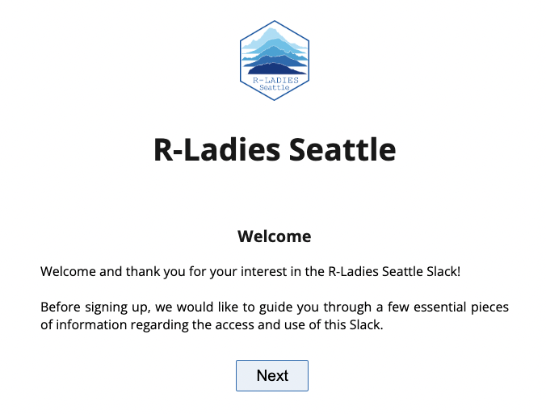
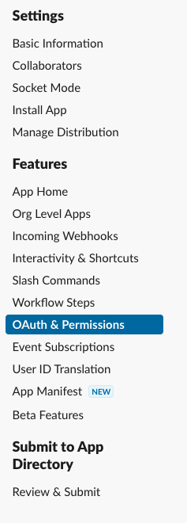
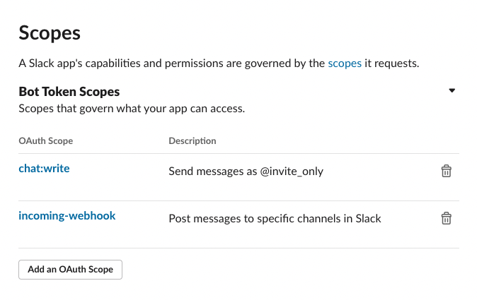
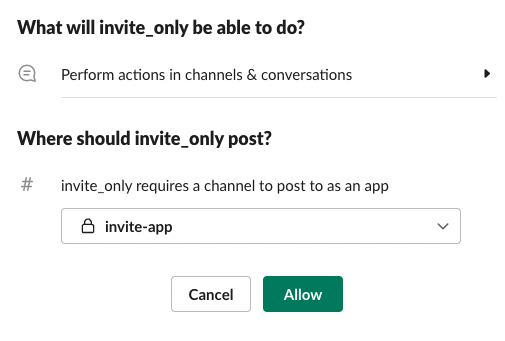

Slack Invite Automation
------------

Custom web app to invite to the R-Ladies Seattle Slack. This is forked from the [outsideris repository](https://github.com/outsideris/slack-invite-automation) with additional inspiration from the [R-Ladies Community fork](https://github.com/rladies/slack-invite-automation) and @StefanWallin [pull request #149](https://github.com/outsideris/slack-invite-automation/pull/149)

<!-- TOC -->

- [Settings](#settings)
    - [`config.js`](#config.js)
    - [`.env`](#.env)
    - [Test locally](#test)
    - [AWS](#aws)
- [Channel ID](#channel-id)
- [Issue token](#issue-token)

<!-- /TOC -->

## Settings

You can set variables for your own purpose in `config.js` or `.env` environment variables.

### `config.js`

Fill out `config.js` as your information.

* `community`: your community or team name to display on join page.
* `slackUrl` : your slack team url (ex.: socketio.slack.com)
* `slackChannel`: your slack channel id (see [Channel ID](#channel-id))
* `slacktoken` : Your access token for Slack. (see [Issue token](#issue-token))
* `inviteToken`: An optional security measure - if it is set, then that token will be required to get invited.
* `recaptchaSiteKey`: An optional security measure - if it is set, and `recaptchaSecretKey` is set, then a captcha will be required to get invited.
* `recaptchaSecretKey`: An optional security measure - if it is set, and `recaptchaSiteKey` is set, then a captcha will be required to get invited.
* `locale`: Application language (currently `cs`, `de`, `en`, `es`, `fr`, `it`,  `ja`, `ko`, `nl`, `pl`, `pt`, `pt-BR`, `tr`, `zh-CN` and `zh-TW` available).
* `subpath`: Sub-path in URL. For example, if `/example` is set, it's served in `/example`, not `/`. Default is `/`.

### `.env`

Or to keep tokens and other information hidden, complete the same information in a new file `.env`. This file should not be tracked by git. See example below. Note that variable names should be in all caps.

```
COMMUNITY_NAME=socketio
SLACK_URL=socketio.slack.com
SLACK_TOKEN=ffsdf-5411524512154-16875416847864648976-45641654654654654-444334f43b34566f
INVITE_TOKEN=abcdefg
LOCALE=en
```

## Test

Run the app locally for testing. This requires `config.js` or `.env` configuration as described above. [Node.js](http://nodejs.org/) is also required.

```shell
$ git clone https://github.com/rladies-seattle/slack-invite-automation.git
$ cd slack-invite-automation
$ npm install
$ npm start
```

You can access <http://localhost:3000> on your web browser.



### aws

If you have an AWS account and have already installed and configured the [AWS CLI tool](https://aws.amazon.com/cli/), you can easily deploy this application to API Gateway and Lambda via CloudFormation in a few minutes.

1. Copy `aws/config.example.sh` to `aws/config.sh`
    - The new file should not be tracked by git.
1. Edit the values in `aws/config.sh`, which correspond to the variables described above, plus these:
    - `StackName`: the name of the CloudFormation stack to create
    - `S3BucketArtifacts`: the name of an existing S3 bucket you have write access to, for storing deployment artifacts
    - `S3PrefixArtifacts`: the prefix to use within that S3 bucket for all deployment artifacts written
1. Run `aws/deploy.sh` to create the CloudFormation stack and deploy your application, outputting the URL
1. (Optional) For a friendlier URL, log into the AWS web console and establish a custom domain pointing to the API Gateway stage deployed in step 3.

## Issue token

1. Visit <https://api.slack.com/apps> and Create New App.

    

1. Click "OAuth & Permissions".

    

1. Under "Scopes", select `chat:write`. If posting to a private channel, also add `incoming-webhook`. Save changes.

    

1. Click "Install App to Workspace". If posting to a private channel, select the appropriate channel where indicated.

    

